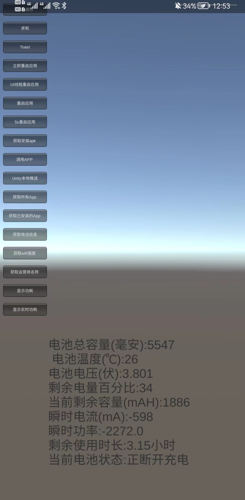

# UnityAndroidInteract
Unity 2020.3  AndroidStudio 4.2.1 aar交互

## 效果图

## 说明
* aar要先删除libs里面的class.jar，然后将外面的class.jar导出，接着删除aar里面的class.jar，然后将外面的class.jar拖到libs里面
* Unity的Plugins里面的AndroidManifest.xml中的包名要跟aar里面的一致，外面的Unity的包名可以不一致

## 引用
* https://www.cnblogs.com/wuzhang/p/wuzhang20170318.html
* https://blog.csdn.net/weixin_45347704/article/details/122597599 unity aar交互
